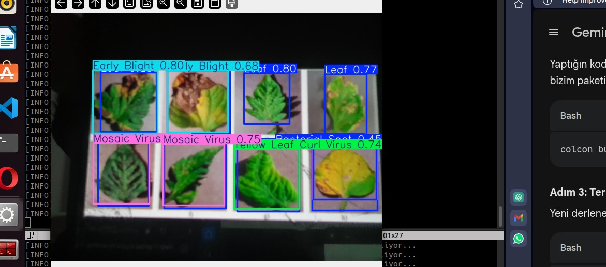

# 🌿 RoBotanic: ROS 2 Real-Time Vision & Control Subsystem

## 📌 Project Overview
This repository contains the core vision, AI, and control integration modules for an autonomous plant disease detection robot. 

**This project represents the deployment phase of my previous YOLOv11 models.** It takes the custom-trained Leaf Detection and Disease Classification models and integrates them into a real-time **ROS 2** ecosystem for hardware deployment. 

**V2.0 Update:** The system now features a dedicated control package that integrates synthetic GPS and time data from a pre-configured MATLAB simulation. This allows the system to synchronize real-time AI detections with spatial data and log them into a CSV file, laying the groundwork for disease heat map generation.

## ⚙️ System Architecture (Nodes)
The architecture is built on a modular ROS 2 workspace containing multiple packages (`robotanik_vision` and `robotanik_control`) communicating in real-time:

* **camera_node**: Captures raw video frames from the hardware camera and publishes them to a specific ROS 2 topic.
* **ai_analyzer_node**: Subscribes to the camera topic, processes the frames through the YOLOv11 models (detecting leaves and specific diseases), draws bounding boxes, and outputs the analyzed feed.
* **location_simulator_node**: Publishes synthetic location (GPS) and time data derived from MATLAB simulations.
* **main_controller_node**: Subscribes to both the AI detections and the location data, synchronizes them, and automatically logs the results into a `.csv` file for heat map mapping.

## 🚀 Key Features
* **Middleware:** ROS 2 (Real-time, multi-package node communication)
* **Computer Vision:** OpenCV & YOLOv11
* **AI Integration:** Deployment of custom-trained plant disease models.
* **Data Logging (Heat Map Prep):** Automated CSV logging of disease type, timestamps, and coordinates.
* **MATLAB Integration:** Processes simulated spatial data alongside real-time vision.

## 🛠️ Installation & Usage
Clone the repository into your ROS 2 workspace and build the packages:

    cd ~/ros2_ws/src
    git clone https://github.com/UmutUsenmez/robotanik-ros2-vision.git
    cd ~/ros2_ws
    colcon build --packages-select robotanik_vision robotanik_control
    source install/setup.bash

## 👨‍💻 Author
**Feyzullah Umut Üşenmez**
Mechatronics Engineering Student @ YTU
Focus Areas: Autonomous Systems, Computer Vision, Embedded AI
